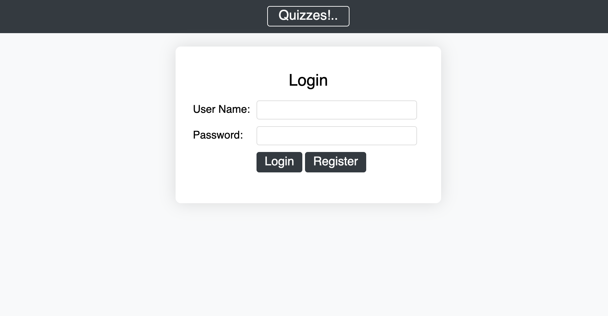
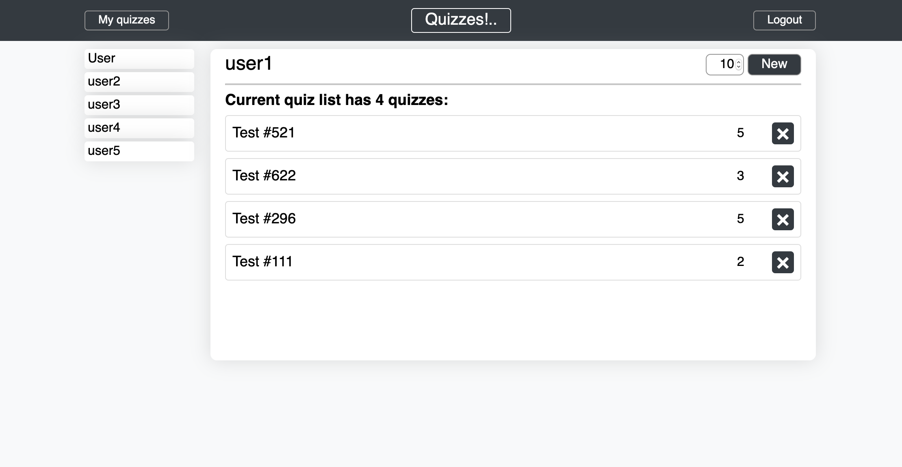
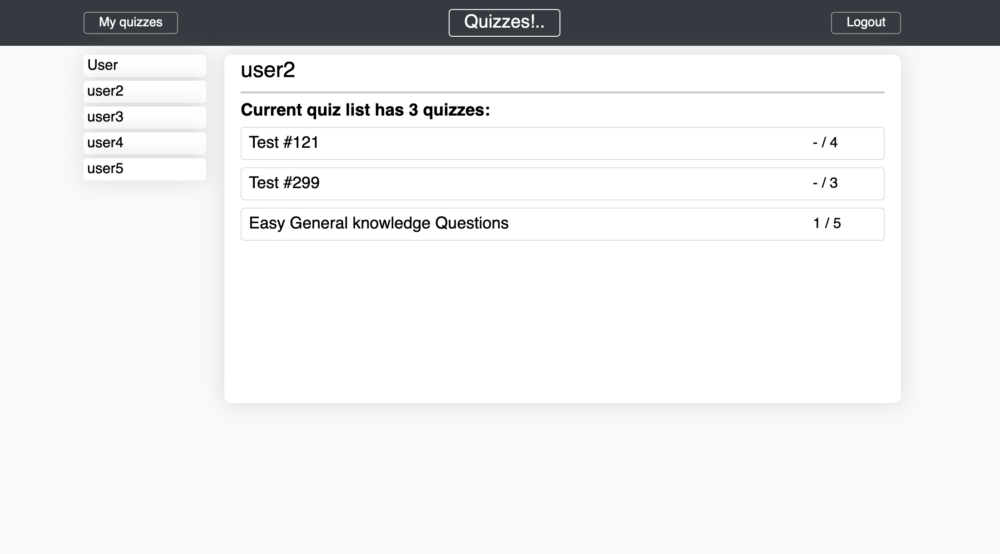
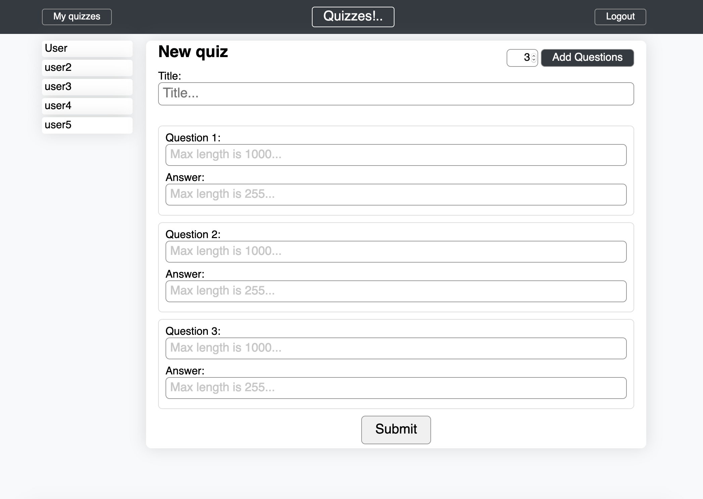
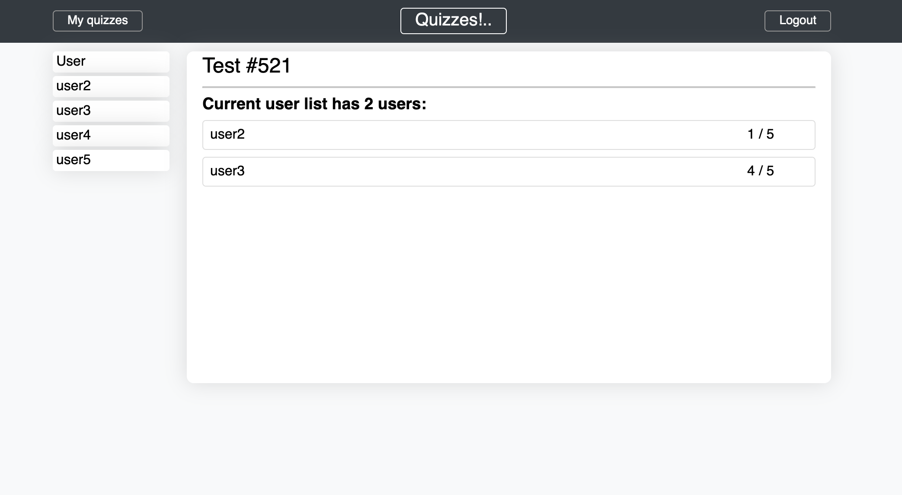
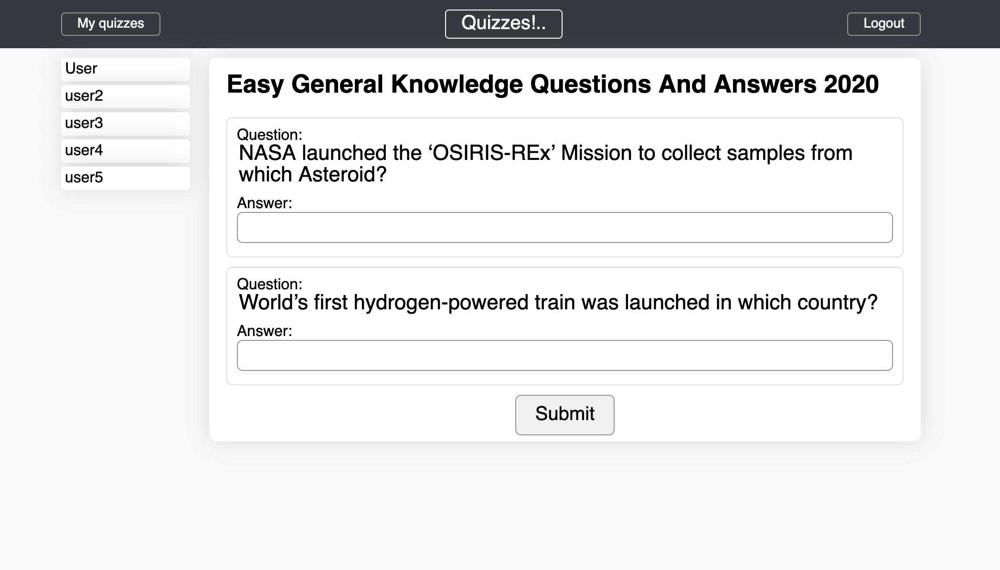

# Quizzes!..

Java EE final project

***

## Technologies

***

- Java EE
- MySQL

***

## Scripts

***

**Compile all `.java` files:**

```!#/zsh
javac -cp .:WEB-INF/lib/servlet-api.jar:WEB-INF/lib/genericdao-3.0.2.jar:WEB-INF/lib/formbeanfactory-3.0.0.jar:WEB-INF/lib/jstl-1.1.2.jar:WEB-INF/lib/standard-1.1.2.jar WEB-INF/classes/**/*.java
```

**Compile one `.java` file:**

```!#/zsh
javac -cp .:WEB-INF/lib/servlet-api.jar:WEB-INF/lib/genericdao-3.0.2.jar:WEB-INF/lib/formbeanfactory-3.0.0.jar:WEB-INF/lib/jstl-1.1.2.jar:WEB-INF/lib/standard-1.1.2.jar <path_to_the_java_file>.java
```

***

## Pages and images

***

### **Login** and **Registration** page (when not logged in)

**URL:** [`http://localhost:8080/finalproject/login.do`](http://localhost:8080/finalproject/login.do)



***

### **Profile** page (when logged in)

**URL:** [`http://localhost:8080/finalproject/prof.do`](http://localhost:8080/finalproject/prof.do)



***

### **Visitor** page (when logged in, `POST` method)

**URL:** [`http://localhost:8080/finalproject/visitorshow.do`](http://localhost:8080/finalproject/visitorshow.do)



***

### **New quiz** page (when logged in)

**URL:** [`http://localhost:8080/finalproject/new-quiz.do`](http://localhost:8080/finalproject/new-quiz.do)



***

### **Quiz information** page (when logged in, `POST` method)

**URL:** [`http://localhost:8080/finalproject/quiz-info.do`](http://localhost:8080/finalproject/quiz-info.do)



***

### **Quiz** page (when logged in, `POST` method)

**URL:** [`http://localhost:8080/finalproject/quiz.do`](http://localhost:8080/finalproject/quiz.do)


